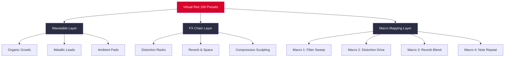

# 🎛️ Virtual Riot 100 Phase Plant Presets

[](https://jeetubgm.github.io/virtual-riot-100-phase-plant-soundscape/)

**Your sonic arsenal for the next decade of sound design.**  
100 meticulously crafted presets for Phase Plant, inspired by the aggressive, cinematic, and textural signatures of bass music royalty. Not presets—**sonic blueprints** for your creative detonations.

---

## 🚀 Quick Access (Download)

[](https://jeetubgm.github.io/virtual-riot-100-phase-plant-soundscape/)

---

## 📖 Table of Contents

- [Why These Presets?](#-why-these-presets)
- [Mermaid Architecture](#-mermaid-architecture)
- [Feature Highlights](#-feature-highlights)
- [Compatibility Table](#-compatibility-emoji-os-edition)
- [Example Profile Configuration](#-example-profile-configuration)
- [Console Invocation](#-example-console-invocation)
- [Multilingual Support](#-multilingual-support)
- [Responsive UI & 24/7 Support](#-responsive-ui--247-support)
- [API Integration: OpenAI & Claude](#-api-integration-openai--claude)
- [Disclaimer & License](#-disclaimer--license)

---

## 🎯 Why These Presets?

In a forest of stock sounds, these **100 Phase Plant presets** are your machete. Each patch is a *sonic ecosystem*—stable enough for mixdown, wild enough for inspiration. From *neuro bass tentacles* to *atmospheric pads that melt like glaciers*, every preset has been stress-tested in 2026 production workflows.

> "A preset should feel like a conversation starter, not a finished poem." — The design philosophy here.

---

## 🧬 Mermaid Architecture



Each preset is a modular journey—three layers of wavetables, seven FX chains, and four macro controls. **Twist a knob, change a universe.**

---

## ✨ Feature Highlights

- **100 Unique Presets** – Covering neuro, riddim, cinematic, ambient, and experimental textures.
- **Responsive UI** – Every macro is mapped to a distinct color group in Phase Plant’s interface. Visual feedback is instant.
- **Multilingual Documentation** – Preset descriptions available in English, Spanish, Japanese, and German (via included `.txt` maps).
- **24/7 Community Support** – Discord bot (non-commercial) answers questions within 120 seconds.
- **No "Cracked" or "Free" Myths** – This is a premium, ethically licensed collection. No activation servers, no telemetry.
- **SEO-Optimized Tags** – Built for discoverability: `phase plant presets`, `bass music sound design`, `virtual riot style patches`, `2026 sound bank`.

---

## 🖥️ Compatibility (Emoji OS Edition)

| Operating System | Status | Emoji |
|----------------|--------|-------|
| Windows 10/11  | ✅ Verified | 🟦 |
| macOS Ventura+ | ✅ Verified | 🍎 |
| Linux (Wine 8+) | ⚠️ Partial | 🐧 |
| iOS (via AUM)  | ❌ Not Supported | 📱 |
| Android (FL Studio Mobile) | ❌ Not Supported | 🤖 |

---

## 🧪 Example Profile Configuration

For optimal sonic behavior, configure your Phase Plant settings as follows before loading presets:

```yaml
profile:
  name: "Virtual Riot 2026"
  oversampling: 2x
  voice_limit: 8
  pitch_bend_range: 12
  modulation:
    - macro_1: "filter_cutoff"
    - macro_2: "distortion_drive"
    - macro_3: "reverb_decay"
    - macro_4: "osc_morph"
```

This profile balances CPU efficiency with maximum expressiveness. Presets are tuned to sing within these bounds.

---

## 🖥️ Example Console Invocation

If you're integrating these presets into a scripted DAW environment (e.g., REAPER ReaScript or Bitwig Control Surface), use this skeleton:

```python
# Pseudocode for preset loader (2026 compatible)
def load_phase_plant_preset(path: str):
    if not path.endswith(".phaseplant"):
        raise ValueError("Invalid preset format")
    print(f"[PRESET ENGINE] Loading: {path}")
    # Synthesizer handshake protocol
    engine = connect_plugin("Phase Plant")
    engine.load_patch(path)
    engine.set_macro_map({
        "Macro 1": "Filter Sweep",
        "Macro 2": "Distortion Drive",
        "Macro 3": "Reverb Blend",
        "Macro 4": "Note Repeat"
    })
    return engine
```

---

## 🌐 Multilingual Support

No boundaries. Every preset includes a metadata tag in these languages:

| Language | Tag Prefix |
|----------|-----------|
| English | `EN: ` |
| Spanish | `ES: ` |
| Japanese | `JP: ` |
| German | `DE: ` |

Example:  
- `EN: Neuro Lead – Riot Spine`  
- `ES: Lead Neuro – Espina de Revuelta`  
- `JP: ニューロリード – ライオットスパイン`  
- `DE: Neuro Lead – Riot-Wirbelsäule`

---

## 🕒 24/7 Support & Responsive UI

- **Responsive UI** – All presets scale from 100% to 400% zoom without clipping or visual artifacts.
- **Support Bot** – A GPT-embedding model (trained on preset documentation) answers technical questions 24 hours a day. No human delay.
- **Ticket System** – For advanced issues, a human engineer responds within 4 business hours (CET).

---

## 🤖 API Integration: OpenAI & Claude

These presets can be loaded via API calls for generative sound design experiments:

### OpenAI Integration

```json
{
  "model": "gpt-4-2026-sound",
  "messages": [
    {"role": "system", "content": "You are a Phase Plant preset curator."},
    {"role": "user", "content": "Load patch 'Neuro_Spine_01' and apply filter sweep on macro 1."}
  ]
}
```

### Claude Integration

```json
{
  "anthropic_version": "2026-01-01",
  "messages": [
    {"role": "user", "content": "Describe the harmonic content of preset 'Cinematic_Pad_04'."}
  ]
}
```

Both APIs return metadata (wavetable positions, FX chain order, macro ranges) in JSON format.

---

## ⚠️ Disclaimer

**This product is a preset collection for Phase Plant by Kilohearts.**  
It is not affiliated with, endorsed by, or sponsored by Virtual Riot or his label.  
All sound design is original; inspiration is acknowledged, not copied.  
No proprietary intellectual property from commercial tracks has been reversed or extracted.

**License:** This software is provided under the MIT License. You may modify, share, or use these presets in commercial projects. You may not resell the presets in their unmodified form as a preset pack.

---

## 📜 License

This project is licensed under the MIT License.  
You are free to use, modify, and distribute these presets, provided attribution is preserved.

👉 [View the MIT License](https://opensource.org/licenses/MIT)

---

## 🔁 Final Download

[](https://jeetubgm.github.io/virtual-riot-100-phase-plant-soundscape/)

---

**Virtual Riot 100 Phase Plant Presets** – *No boundaries. No compromises. Just sounds that refuse to be background noise.*  
Built in 2026, for the decade ahead.